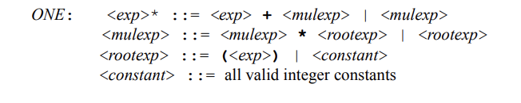
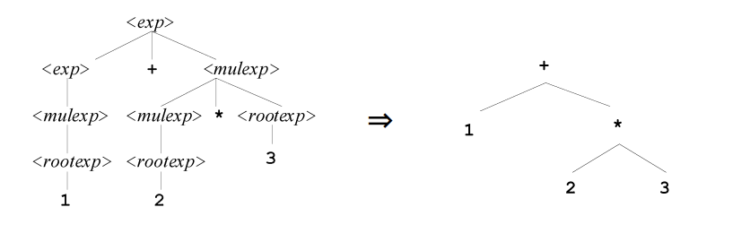
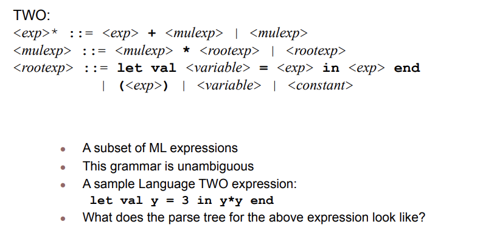

# Week-9 Prolog & Formal Semantics tutorial by Jimmy Zhang
## A third look into prolog
### Artithmetic
  - **artithmetic** is expected in a language like prolog
  - the only difference between prolong and other programming languages is that prolog use the predicate is rather than the equal sign 

### Prolog I/O (input/ output)
  - **writing** is true if term is a prolog term, writes term to the terminal.
  
  **example of write:**
  
?- write(56).
  
56

yes

?- write('hello').

hello

yes

?- write('hello'),nl,write('world').

hello

world

yes

?- write("ABCDE").

[65,66,67,68,69]

yes

  
  - **reading** is true if the user types a term followed by a period ,X becomes unified to the term.
  
  **example of read:** 
  
?- read(X).

|: boo.  % |: is a prolog I/O prompt.

X = boo

  - **nl** is alway true, new line character on the terminal 
  
  practice -->  https://www.tutorialspoint.com/prolog/prolog_inputs_and_outputs.htm
- **Interaction Loops** - similar to any loop in other program

  practice -->  https://www.tutorialspoint.com/prolog/prolog_inputs_and_outputs.htm
## Formal Semantics 
### Language one 
now looking back on in first few weeks of of the tutorials we learn about syntax and semantics.
simple review
  - the structure of a lanuage defines its syntax
  - semantic is define by it behavoir
    - to the point -> use a simple interpreter for the programming language thar highlights the behavior of the lanuguage. -> operational semantics
    **example for operational semantic:
    
  - **abstraction syntax trees** - use to define operational semantics  -> abstract interpreter for the language
  - you may ask use parse tree but that is not very convenient and it has too many terminal symbols -> Abstract syntax tree(AST)
  - ASTs and parenteses
    - () are not needed because it will naturally represent both associativity and precedence relations
    - **example:**
    
    
### Language Two
- extension of language one with varibles, an ML style Let expression for defining.
- Additional abstract syntax nodes for language TWO:
  - var(X) dereferences a variable X
  - let(X,E1,E2) binds the variable X to expression E1 in the
context of expression E2.

**Example of this** : let val y = 4 in y*y end ->  let(y,const(4),times(var(y),var(y)))

## Reference 
- Webber, Adam. Modern Programming Languages: A Practical Introduction. Franklin, Beedle &amp; Associates, 2002. 
- “Prolog Tutorial.” Tutorials Point, https://www.tutorialspoint.com/prolog/index.htm. 
